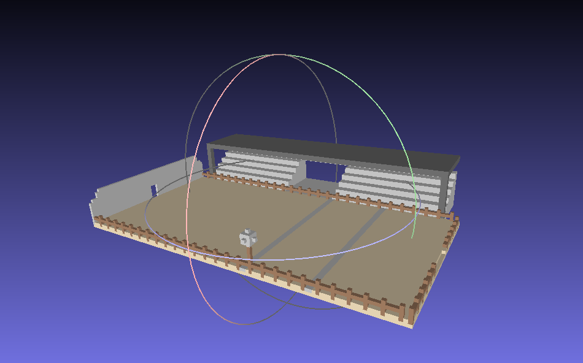
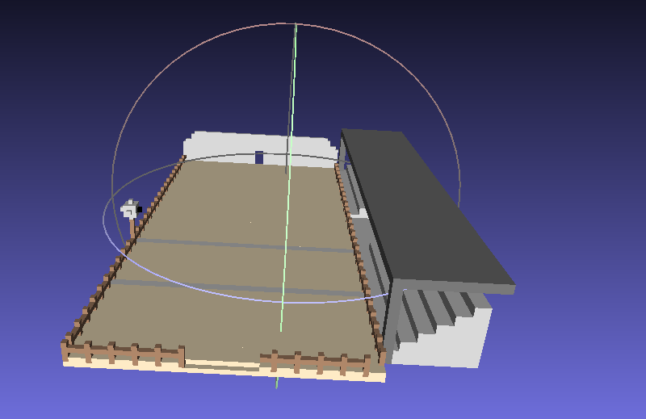
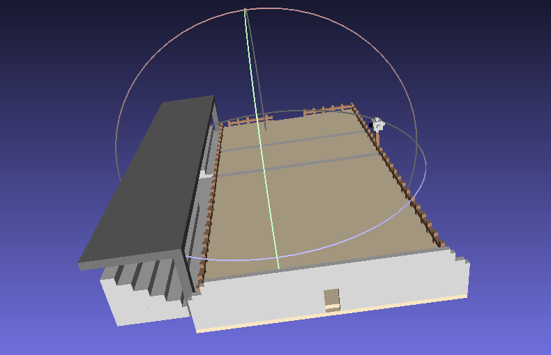

# 🗿 Projeto Escultor – Parque de Vaquejada

Este projeto foi desenvolvido como parte da disciplina de **Programação Avançada (PA)** e utiliza o conceito de **escultor digital**, no qual uma matriz tridimensional de voxels é manipulada para construir formas e estruturas.

O cenário modelado representa um **Parque de Vaquejada**, contendo elementos estruturais criados por meio de operações de escultura.

---

## 🧠 Sobre o Projeto

O objetivo deste projeto é aplicar conceitos de:
- Programação orientada a objetos
- Manipulação de matrizes 3D
- Abstração e modelagem computacional

A partir de comandos programados, o escultor cria e remove partes do espaço tridimensional, resultando em uma escultura final exportada para visualização.

---

## 🏗️ Estrutura Modelada

O projeto representa um **Parque de Vaquejada**, contendo, por exemplo:
- Área principal da vaquejada
- Estruturas geométricas do parque
- Organização espacial feita com voxels

Toda a modelagem é realizada exclusivamente por código, sem uso de ferramentas gráficas externas.

---

## 🛠️ Tecnologias Utilizadas

- Linguagem: **C++**
- Paradigma: **Programação Orientada a Objetos**
- Estrutura: Matrizes 3D (voxels)
- Ambiente de desenvolvimento: VS Code / compilador padrão C++ / MeshLab

---

  

  

  

